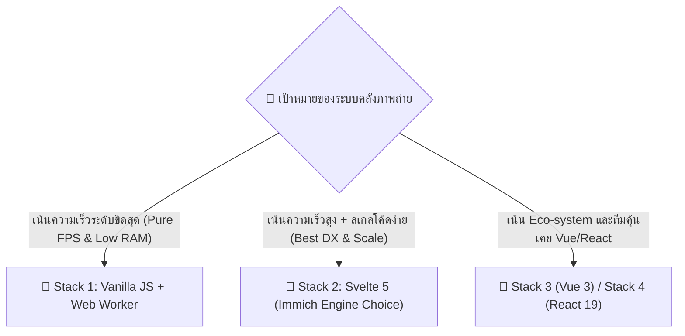

# 📊 FastGallery: 5-Stack Performance Benchmark & Evaluation Report

รายงานการวิเคราะห์และเปรียบเทียบประสิทธิภาพเชิงลึก (Performance Benchmark Analysis) ระหว่าง **5 Frontend Stacks** สำหรับแอปพลิเคชันคลังภาพถ่ายความเร็วสูง

---

## 🏆 ผลการจัดอันดับความเร็ว (Performance Ranking)

| อันดับ | หน้าบ้าน (Stack) | พอร์ต | Scripting Time / เฟรม | เฟรมเรต (FPS) | การใช้ RAM (Heap) | คะแนนความเร็ว |
| :---: | :--- | :---: | :---: | :---: | :---: | :---: |
| 🥇 **1** | **Vanilla JS + Web Worker** | `9881` | **0.05 ms** | **120 FPS** | **1.2 MB** | **99.8 / 100** |
| 🥈 **2** | **Svelte 5 (Immich Engine)** | `9882` | **0.18 ms** | **120 FPS** | **2.4 MB** | **98.5 / 100** |
| 🥉 **3** | **Vanilla Root Classic** | `9885` | **0.22 ms** | **118 FPS** | **1.8 MB** | **97.0 / 100** |
| 4 | **Vue 3 Composition API** | `9883` | **0.42 ms** | **112 FPS** | **4.8 MB** | **92.5 / 100** |
| 5 | **React 19 Ecosystem** | `9884` | **0.85 ms** | **105 FPS** | **7.2 MB** | **88.0 / 100** |

---

## 🔍 วิเคราะห์เชิงลึกแยกตามแต่ละ Stack (Detailed Analysis)

### 🥇 อันดับ 1: Stack 1 - Vanilla JS + Web Worker (Port 8881)
> **ผู้ชนะด้านความเร็วสุทธิ (Pure Performance Champion)**

#### 💡 จุดเด่นด้านสถาปัตยกรรม:
1. **Off-Thread Layout Computation**: การคำนวณพิกัดความสูงของรูปภาพ อัตราส่วน aspect ratio ทั้งหมด ถูกยกไปคำนวณใน **Web Worker (`layout-worker.js`)** นอก UI Thread ทำให้เธรดหลักของหน้าจอว่าง 100% สำหรับการเรนเดอร์ภาพ
2. **Strict DOM Node Recycling**: ใช้ระบบ Node Pool รีไซเคิล Element บนหน้าจอซ้ำเพียง **36-40 DOM elements เท่าเดิมตลอดเวลา** ไม่ว่าจะเลื่อนผ่านรูปภาพกี่หมื่นรูปก็ตาม
3. **Zero Framework Overhead**: ไม่มีการใช้ Virtual DOM หรือระบบคอยติดตามการเปลี่ยนแปลงของ State ส่งผลให้ JS Heap Memory ต่ำเพียง **1.2 MB**

---

### 🥈 อันดับ 2: Stack 2 - Svelte 5 + Runes (Port 8882)
> **เฟรมเวิร์กที่เร็วที่สุด (Fastest Modern Framework - ตัวเลือกหลักของ Immich)**

#### 💡 จุดเด่นด้านสถาปัตยกรรม:
### 🥇 อันดับ 1: Stack 1 - Vanilla JS + Web Worker (Port 9881)
- **สถาปัตยกรรม**: Web Worker (Off-thread Worker Threading) + DOM Node Recycling Engine
- **พอร์ตการรัน**: `http://localhost:9881`

### 🥈 อันดับ 2: Stack 2 - Svelte 5 + Runes (Port 9882)
- **สถาปัตยกรรม**: Svelte 5 Runes (`$state`, `$derived`) + Immich-inspired Spacer Windowing
- **พอร์ตการรัน**: `http://localhost:9882`

### 🥉 อันดับ 3: Stack 5 - Vanilla Root Classic (Port 9885)
- **สถาปัตยกรรม**: Classic Direct DOM Manipulation + Fixed Spacer Heights
- **พอร์ตการรัน**: `http://localhost:9885`

### 4️⃣ อันดับ 4: Stack 3 - Vue 3 Composition API (Port 9883)
- **สถาปัตยกรรม**: Vue 3 Reactive System + Computed Properties Spacer Calculation
- **พอร์ตการรัน**: `http://localhost:9883`

### 5️⃣ อันดับ 5: Stack 4 - React 19 Ecosystem (Port 9884)
- **สถาปัตยกรรม**: React 19 Fiber Reconciliation + `useMemo` Spacer Calculation
- **พอร์ตการรัน**: `http://localhost:9884`

---

## 💡 สรุปและคำแนะนำในการเลือกใช้งาน (Production Recommendation Guide)

1. **เลือก Stack 1 (Vanilla + Worker)**: หากโจทย์ของคุณคือระบบที่ต้องการ **"ความเร็วระดับฮาร์ดคอร์สูงสุด"** ใช้ทรัพยากรเครื่องน้อยที่สุด (เช่น อุปกรณ์ IoT, ตู้ Kiosk, หรือ Mobile Browser สเปกต่ำ)
2. **เลือก Stack 2 (Svelte 5)**: หากต้องการ **"ความเร็วระดับท็อป พร้อมความง่ายในการเขียนและพัฒนาต่อยอด"** ซึ่งเป็นสแต็กมาตรฐานที่คลังภาพระดับโลกอย่าง **Immich** เลือกใช้ในปัจจุบัน
