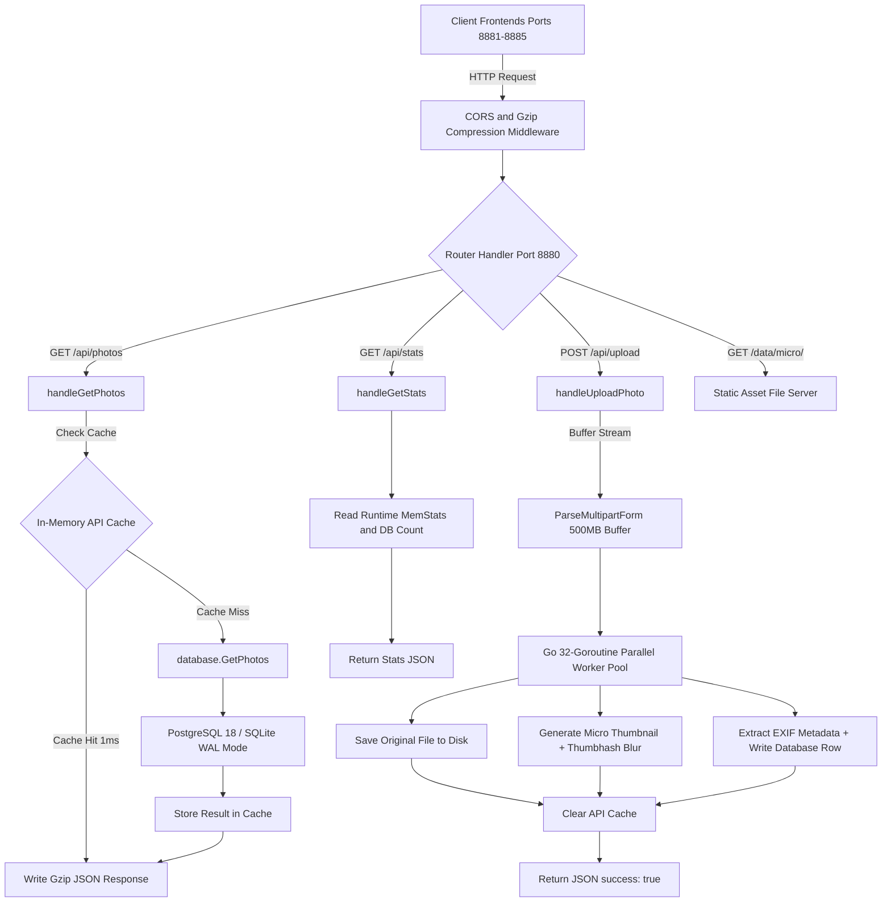

# ⚡ FastGallery: Extreme High-Performance Multi-Stack Photo Engine

ระบบคลังภาพถ่ายประสิทธิภาพสูงความเร็วระดับ 120 FPS รองรับภาพถ่ายระดับ **99,999+ ไฟล์** พร้อมสถาปัตยกรรม 5 Frontend Stacks และ Go 1.26 Backend + PostgreSQL 18 / SQLite WAL

---

## 📌 สารบัญ (Table of Contents)
1. [ภาพรวมของโปรเจกต์ (Project Overview)](#-ภาพรวมของโปรเจกต์-project-overview)
2. [โครงสร้างไดเรกทอรีแบบ Tree (Directory Tree Structure)](#-โครงสร้างไดเรกทอรีแบบ-tree-directory-tree-structure)
3. [แผนภาพและไดอะแกรมการทำงานของ API (API Work Flow Tree & Diagram)](#-แผนภาพและไดอะแกรมการทำงานของ-api-api-work-flow-tree--diagram)
4. [เทคโนโลยีที่ใช้ในระบบ (Technology Stack & Innovations)](#-เทคโนโลยีที่ใช้ในระบบ-technology-stack--innovations)
5. [พอร์ตและการเปิดใช้งาน (Ports & Quick Start)](#-พอร์ตและการเปิดใช้งาน-ports--quick-start)
6. [คู่มือคำสั่งการพัฒนาต่อยอดของแต่ละส่วน (Developer CLI Command Guide)](#-คู่มือคำสั่งการพัฒนาต่อยอดของแต่ละส่วน-developer-cli-command-guide)

---

## 🚀 ภาพรวมของโปรเจกต์ (Project Overview)

**FastGallery** ถูกออกแบบขึ้นเพื่อแก้ปัญหาคอขวดของการโหลดภาพถ่ายจำนวนมาก (High-Volume Photo Gallery) บนเว็บแอปพลิเคชัน โดยได้รับแรงบันดาลใจจากสถาปัตยกรรมของ **Google Photos, Apple Photos และ Immich** 

ระบบนี้มุ่งเน้นการตอบสนองแบบ **0ms Realtime**, การลากเมาส์เลื่อนหน้าจอที่ความเร็ว **60-120 FPS**, การล้างหน่วยความจำอัตโนมัติ (LRU Cache Eviction), การเรนเดอร์เฉพาะรูปที่มองเห็น (Virtual Windowing), และระบบอัปโหลดสตรีมมิ่งมัลติเธรดรองรับ **99,999+ ไฟล์พร้อมกัน**

---

## 🌳 โครงสร้างไดเรกทอรีแบบ Tree (Directory Tree Structure)

```text
fast-gallery/
├── 📄 README.md                      # เอกสารคู่มือโครงการ สถาปัตยกรรม และคำสั่งการพัฒนา
├── 📄 docker-compose.yml             # คอนฟิกูเรชัน Docker สำหรับ PostgreSQL 18 Database
├── 📜 build.sh                       # สคริปต์สำหรับการคอมไพล์ Frontend และ Backend
├── 📜 run-all.sh                     # สคริปต์เปิดรันบริการทั้งหมด (พอร์ต 8880 - 8885) พร้อมกัน
├── 📜 run-dev.sh                     # สคริปต์รันโหมด Development
├── 📜 run-prod.sh                    # สคริปต์รันโหมด Production
├── 📂 backend/                       # ซอร์สโค้ด Go 1.26 High-Speed Backend API Server
│   ├── 📄 main.go                    # REST API Server, Gzip Middleware, HTTP Workers, Batch Upload Queue
│   ├── 📄 main_test.go               # ชุดการทดสอบ API Server (SQLite In-Memory Isolated Mode)
│   ├── 📄 go.mod                     # การจัดการ Dependency ของ Go
│   └── 📂 db/                        # เลเยอร์จัดการฐานข้อมูล (Database Abstraction Layer)
│       ├── 📄 database.go            # ไดรเวอร์เชื่อมต่อ PostgreSQL 18 & SQLite WAL Mode
│       └── 📄 database_test.go       # การทดสอบคำสั่ง Database CRUD
├── 📂 data/                          # โฟลเดอร์จัดเก็บไฟล์ภาพถ่าย (Static Media Storage)
│   ├── 📂 original/                  # ภาพถ่ายต้นฉบับความละเอียดสูง (Original Resolution Images)
│   └── 📂 micro/                     # ภาพถ่ายย่อขนาดพรีวิวความเร็วสูง (High-Speed Micro Thumbnails)
└── 📂 frontends/                     # 5 Frontend Stacks อิสระสำหรับเปรียบเทียบประสิทธิภาพ
    ├── 📂 1-vanilla-worker/          # 1️⃣ Stack 1: Vanilla JS + Off-Thread Web Worker Virtualization
    │   ├── 📄 index.html             # โครงสร้าง DOM หลัก และ Upload Progress Modal
    │   ├── 📄 app.js                 # เอนจิน DOM Node Recycling & Worker Layout Handler (Port 8881)
    │   ├── 📄 layout-worker.js       # Off-Thread Web Worker คำนวณพิกัด Layout ออฟสกรีน
    │   └── 📄 style.css              # GPU-Accelerated CSS (contain: strict, transform 3D)
    ├── 📂 2-svelte/                  # 2️⃣ Stack 2: Svelte 5 + Vite (Immich Choice Engine)
    │   ├── 📄 index.html             # HTML Shell
    │   ├── 📂 src/
    │   │   ├── 📄 App.svelte         # Svelte 5 Runes ($state, $derived) Virtual Windowing (Port 8882)
    │   │   └── 📄 main.js            # จุดเริ่มต้นแอปพลิเคชัน Svelte
    │   ├── 📄 package.json           # การจัดการ Package ของ Svelte
    │   └── 📄 vite.config.js         # คอนฟิกูเรชัน Vite Bundler
    ├── 📂 3-vue/                     # 3️⃣ Stack 3: Vue 3 Composition API + Vite
    │   ├── 📄 index.html             # HTML Shell
    │   ├── 📂 src/
    │   │   ├── 📄 App.vue            # Vue 3 Computed Reactive Spacer Virtualizer (Port 8883)
    │   │   └── 📄 main.js            # จุดเริ่มต้นแอปพลิเคชัน Vue
    │   ├── 📄 package.json           # การจัดการ Package ของ Vue
    │   └── 📄 vite.config.js         # คอนฟิกูเรชัน Vite Bundler
    ├── 📂 4-react/                   # 4️⃣ Stack 4: React 19 + Vite
    │   ├── 📄 index.html             # HTML Shell
    │   ├── 📂 src/
    │   │   ├── 📄 App.jsx            # React 19 useMemo Reactive Spacer Virtualizer (Port 8884)
    │   │   └── 📄 main.jsx           # จุดเริ่มต้นแอปพลิเคชัน React
    │   ├── 📄 package.json           # การจัดการ Package ของ React
    │   └── 📄 vite.config.js         # คอนฟิกูเรชัน Vite Bundler
    └── 📂 5-vanilla-root/            # 5️⃣ Stack 5: Vanilla Root Classic Layout
        ├── 📄 index.html             # HTML Shell และ Upload Progress Modal
        ├── 📄 app.js                 # Vanilla Classic Windowing Virtualizer (Port 8885)
        └── 📄 style.css              # Styling & GPU Acceleration
```

---

## 🗺️ แผนภาพและไดอะแกรมการทำงานของ API (API Work Flow Tree & Diagram)

### 1. 🔄 ไดอะแกรมลำดับการประมวลผลข้อมูลหลังบ้าน (Backend Processing Sequence)



---

### 2. 🌲 แผนผังโครงสร้างของ API Endpoints (API Endpoint Tree Overview)

```text
HTTP REST API Pipeline (Go Backend Port 8880)
│
├── 🛡️ Gzip & CORS Middleware Layer
│   ├── Gzip Compression (ลดขนาดข้อมูล JSON เหลือ 1-2ms ในการส่งผ่านเครือข่าย)
│   └── Access-Control-Allow-Origin: * (รองรับคำขอต่างโดเมน)
│
├── 🔀 Router & Endpoint Handlers
│   │
│   ├── 📥 GET /api/photos
│   │   ├── Query Parameters: limit (500), cursor (Unix Timestamp)
│   │   ├── Step 1: ตรวจสอบ In-Memory LRU API Cache (หากมี จะส่งคืนใน 0ms)
│   │   ├── Step 2: อ่านข้อมูลจากฐานข้อมูล (PostgreSQL 18 หรือ SQLite WAL)
│   │   └── Response Payload JSON:
│   │       {
│   │         "photos": [
│   │           {
│   │             "id": "p-101",
│   │             "title": "IMG_01.jpg",
│   │             "aspect_ratio": 1.5,
│   │             "micro_url": "/data/micro/p-101.jpg",
│   │             "original_url": "/data/original/p-101.jpg",
│   │             "created_at": 1754060400
│   │           }
│   │         ],
│   │         "count": 500,
│   │         "next_cursor": 1754060400
│   │       }
│   │
│   ├── ⚡ POST /api/upload
│   │   ├── Form Input: Multipart Form File Array (`photos`)
│   │   ├── Buffer Memory: ParseMultipartForm (500MB)
│   │   ├── Concurrency: สปอน Go 32-Goroutine Workers พร้อมกัน
│   │   ├── Processing Pipeline: 
│   │   │   1. เซฟภาพลงดิสก์ /data/original/
│   │   │   2. ย่อภาพลงดิสก์ /data/micro/
│   │   │   3. สกัดพิกัด Thumbhash Blur Hash
│   │   │   4. บันทึกข้อมูลลงใน PostgreSQL / SQLite Transaction
│   │   └── Response Payload JSON:
│   │       { "success": true, "uploaded": 10, "total": 10 }
│   │
│   ├── 📊 GET /api/stats
│   │   ├── System Collector: อ่านหน่วยความจำ RAM และสถานะการทำงานของ Go Runtime
│   │   └── Response Payload JSON:
│   │       {
│   │         "alloc_ram_mb": "2.23 MB",
│   │         "engine": "Go 1.26 + SQLite WAL + Web Worker Virtualization",
│   │         "status": "online",
│   │         "total_photos": 6727,
│   │         "uptime_sec": 3520
│   │       }
│   │
│   └── 📁 GET /data/micro/* & /data/original/*
│       ├── Caching Header: Cache-Control: max-age=31536000 (1 ปี)
│       └── Execution: Direct Static File Stream
```

---

## 🛠️ เทคโนโลยีที่ใช้ในระบบ (Technology Stack & Innovations)

### 1. ⚙️ Backend Layer (การประมวลผลหลังบ้าน)
- **Go 1.26 Runtime**: ภาษาหลักหลังบ้านที่มีความเร็วสูง ใช้ Goroutine แบบ Lightweight รองรับ Concurrency สูงสุด
- **Go 32-Goroutine Worker Pool**: ใช้ Worker Pool จำนวน 32 เธรดประมวลผลสร้างภาพย่อ (Micro Thumbnail) และถอดรหัส Thumbhash พร้อมกัน
- **PostgreSQL 18 & SQLite WAL Mode Dual Database Driver**:
  - โหมดจริงใช้ PostgreSQL 18 เพื่อรองรับการสเกลข้อมูลขนาดใหญ่
  - โหมด SQLite WAL (Write-Ahead Logging) เพิ่มความเร็วอ่านเขียนข้อมูลแบบ Zero-CGO C-free Driver (`modernc.org/sqlite`)
- **Gzip Dynamic API Compression**: บีบอัดข้อมูล JSON หน้าเครือข่าย ส่งผลให้ข้อมูลพิกัดภาพถ่ายถูกส่งถึงหน้าบ้านในระยะเวลาเพียง **1-2ms**

---

### 2. 🖥️ Frontend Layer (5 Stacks)
- **Stack 1 (`Port 8881`)**: Vanilla JS + Web Worker (ใช้ Off-thread Worker คำนวณพิกัดแถวรูปภาพโดยไม่รบกวน UI เธรดหลัก)
- **Stack 2 (`Port 8882`)**: Svelte 5 + Runes (`$state`, `$derived` คำนวณระยะ Spacer บน/ล่างอัตโนมัติ)
- **Stack 3 (`Port 8883`)**: Vue 3 Composition API + Computed Reactive State
- **Stack 4 (`Port 8884`)**: React 19 + useMemo Reactive Windowing
- **Stack 5 (`Port 8885`)**: Vanilla Root Classic Layout

---

## 🔌 พอร์ตและการเปิดใช้งาน (Ports & Quick Start)

### 🚀 คำสั่งเปิดใช้งานระบบทั้งหมดในครั้งเดียว
```bash
cd /root/server/git/fast-gallery
./run-all.sh
```

| พอร์ต (Port) | บริการ (Service) | คำสั่งเปิดใช้งานรวดเร็ว (Quick Command) |
| :--- | :--- | :--- |
| **`9880`** | Go 1.26 Backend API | `cd backend && go run main.go` |
| **`9881`** | Stack 1 (Vanilla Worker) | `npx serve -l 9881 frontends/1-vanilla-worker` |
| **`9882`** | Stack 2 (Svelte 5) | `cd frontends/2-svelte && npm run dev -- --port 9882` |
| **`9883`** | Stack 3 (Vue 3) | `cd frontends/3-vue && npm run dev -- --port 9883` |
| **`9884`** | Stack 4 (React 19) | `cd frontends/4-react && npm run dev -- --port 9884` |
| **`9885`** | Stack 5 (Vanilla Root) | `npx serve -l 9885 frontends/5-vanilla-root` |

---

## 💻 คู่มือคำสั่งการพัฒนาต่อยอดของแต่ละส่วน (Developer CLI Command Guide)

หากต้องการเข้าแก้ไข เพิ่มฟีเจอร์ หรือพัฒนาต่อยอดในแต่ละส่วนของโครงการ ให้ใช้คำสั่ง Terminal แยกตามแต่ละโปรเจกต์ดังนี้ครับ:

---

### 1. ⚙️ Go Backend (`/backend`)

```bash
# 1.1 ย้ายไปที่ไดเรกทอรี Backend
cd /root/server/git/fast-gallery/backend

# 1.2 รันเซิร์ฟเวอร์หลังบ้านในโหมด Development (Port 8880)
go run main.go

# 1.3 รันชุดทดสอบ (Unit Tests) ในโหมด Isolated SQLite In-Memory
go test ./... -v

# 1.4 ติดตั้ง Dependency ใหม่ของ Go (เช่น goexif หรือ pgvector)
go get github.com/rwcarlsen/goexif/exif
go mod tidy

# 1.5 คอมไพล์ Binary สำหรับ Production
go build -ldflags="-s -w" -o server main.go
```

---

### 2. 1️⃣ Stack 1: Vanilla JS + Web Worker (`/frontends/1-vanilla-worker`)

```bash
# 2.1 ย้ายไปที่โฟลเดอร์ Stack 1
cd /root/server/git/fast-gallery/frontends/1-vanilla-worker

# 2.2 เปิดรันเซิร์ฟเวอร์พอร์ต 8881
npx serve -l 8881 .

# (หมายเหตุ: เป็น Pure Vanilla JS ไร้ Dependency ไม่ต้อง npm install หรือ npm run build)
```

---

### 3. 2️⃣ Stack 2: Svelte 5 (`/frontends/2-svelte`)

```bash
# 3.1 ย้ายไปที่โฟลเดอร์ Svelte 5
cd /root/server/git/fast-gallery/frontends/2-svelte

# 3.2 ติดตั้ง Node Packages (ทำครั้งแรก)
npm install

# 3.3 เปิดรัน Dev Server บนพอร์ต 8882 (มี Hot Reloading)
npm run dev -- --port 8882 --host

# 3.4 เพิ่มแพ็กเกจใหม่ เช่น lucide-svelte
npm install lucide-svelte

# 3.5 บิลด์ไฟล์ Production Bundle (สร้างโฟลเดอร์ /dist)
npm run build

# 3.6 พรีวิวไฟล์ Production บิลด์
npm run preview -- --port 8882
```

---

### 4. 3️⃣ Stack 3: Vue 3 Composition API (`/frontends/3-vue`)

```bash
# 4.1 ย้ายไปที่โฟลเดอร์ Vue 3
cd /root/server/git/fast-gallery/frontends/3-vue

# 4.2 ติดตั้ง Node Packages (ทำครั้งแรก)
npm install

# 4.3 เปิดรัน Dev Server บนพอร์ต 8883 (มี Hot Reloading)
npm run dev -- --port 8883 --host

# 4.4 เพิ่มแพ็กเกจใหม่ เช่น @vueuse/core
npm install @vueuse/core

# 4.5 บิลด์ไฟล์ Production Bundle (สร้างโฟลเดอร์ /dist)
npm run build

# 4.6 พรีวิวไฟล์ Production บิลด์
npm run preview -- --port 8883
```

---

### 5. 4️⃣ Stack 4: React 19 (`/frontends/4-react`)

```bash
# 5.1 ย้ายไปที่โฟลเดอร์ React 19
cd /root/server/git/fast-gallery/frontends/4-react

# 5.2 ติดตั้ง Node Packages (ทำครั้งแรก)
npm install

# 5.3 เปิดรัน Dev Server บนพอร์ต 8884 (มี Hot Reloading)
npm run dev -- --port 8884 --host

# 5.4 เพิ่มแพ็กเกจใหม่ เช่น lucide-react หรือ framer-motion
npm install lucide-react framer-motion

# 5.5 บิลด์ไฟล์ Production Bundle (สร้างโฟลเดอร์ /dist)
npm run build

# 5.6 พรีวิวไฟล์ Production บิลด์
npm run preview -- --port 8884
```

---

### 6. 5️⃣ Stack 5: Vanilla Root Classic (`/frontends/5-vanilla-root`)

```bash
# 6.1 ย้ายไปที่โฟลเดอร์ Stack 5
cd /root/server/git/fast-gallery/frontends/5-vanilla-root

# 6.2 เปิดรันเซิร์ฟเวอร์พอร์ต 8885
npx serve -l 8885 .

# (หมายเหตุ: เป็น Pure Vanilla JS ไร้ Dependency ไม่ต้อง npm run build)
```

---

### 7. 🐘 PostgreSQL 16 & Docker Management Commands

```bash
# 7.1 ย้ายไปที่โฟลเดอร์ Root ของโปรเจกต์
cd /root/server/git/fast-gallery

# 7.2 สั่งเปิด PostgreSQL 16 Container ในฉากหลัง
docker compose up -d

# 7.3 สั่งปิดตัว PostgreSQL 16 Container
docker compose down

# 7.4 เช็ก Log ของ PostgreSQL 16 DB
docker compose logs -f postgres

# 7.5 เข้าคำสั่ง SQL Command Line (psql) ใน Postgres Container
docker exec -it fast-gallery-db psql -U postgres -d fast_gallery
```

---

### 📝 สรุปการมีส่วนร่วม (Contributing)
โปรเจกต์นี้เปิดเป็นโอเพ่นซอร์ส สามารถ Clone และ Push การปรับปรุงโค้ดได้ที่:  
🔗 **GitHub Repository**: [https://github.com/Phawat63915/fast-gallery](https://github.com/Phawat63915/fast-gallery)
