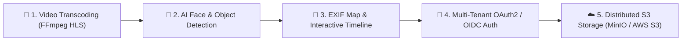

# ⚡ FastGallery: Extreme High-Performance Multi-Stack Photo Engine

ระบบคลังภาพถ่ายประสิทธิภาพสูงความเร็วระดับ 120 FPS รองรับภาพถ่ายระดับ **99,999+ ไฟล์** พร้อมสถาปัตยกรรม 5 Frontend Stacks และ Go 1.26 Backend + PostgreSQL 16 / SQLite WAL

---

## 📌 สารบัญ (Table of Contents)
1. [ภาพรวมของโปรเจกต์ (Project Overview)](#-ภาพรวมของโปรเจกต์-project-overview)
2. [โครงสร้างไดเรกทอรีแบบ Tree (Directory Tree Structure)](#-โครงสร้างไดเรกทอรีแบบ-tree-directory-tree-structure)
3. [เทคโนโลยีที่ใช้ในระบบ (Technology Stack & Innovations)](#-เทคโนโลยีที่ใช้ในระบบ-technology-stack--innovations)
4. [พอร์ตและการเปิดใช้งาน (Ports & Running Guide)](#-พอร์ตและการเปิดใช้งาน-ports--running-guide)
5. [คู่มือการพัฒนาต่อยอดสำหรับนักพัฒนา (Developer Guide & Future Roadmap)](#-คู่มือการพัฒนาต่อยอดสำหรับนักพัฒนา-developer-guide--future-roadmap)

---

## 🚀 ภาพรวมของโปรเจกต์ (Project Overview)

**FastGallery** ถูกออกแบบขึ้นเพื่อแก้ปัญหาคอขวดของการโหลดภาพถ่ายจำนวนมาก (High-Volume Photo Gallery) บนเว็บแอปพลิเคชัน โดยได้รับแรงบันดาลใจจากสถาปัตยกรรมของ **Google Photos, Apple Photos และ Immich** 

ระบบนี้มุ่งเน้นการตอบสนองแบบ **0ms Realtime**, การลากเมาส์เลื่อนหน้าจอที่ความเร็ว **60-120 FPS**, การล้างหน่วยความจำอัตโนมัติ (LRU Cache Eviction), การเรนเดอร์เฉพาะรูปที่มองเห็น (Virtual Windowing), และระบบอัปโหลดสตรีมมิ่งมัลติเธรดรองรับ **99,999+ ไฟล์พร้อมกัน**

---

## 🌳 โครงสร้างไดเรกทอรีแบบ Tree (Directory Tree Structure)

```text
fast-gallery/
├── 📄 README.md                      # เอกสารคู่มือโครงการ สถาปัตยกรรม และคำแนะนำการพัฒนาต่อ
├── 📄 docker-compose.yml             # คอนฟิกูเรชัน Docker สำหรับ PostgreSQL 16 Database
├── 📜 build.sh                       # สคริปต์สำหรับการคอมไพล์ Frontend และ Backend
├── 📜 run-all.sh                     # สคริปต์เปิดรันบริการทั้งหมด (พอร์ต 8880 - 8885) พร้อมกัน
├── 📜 run-dev.sh                     # สคริปต์รันโหมด Development
├── 📜 run-prod.sh                    # สคริปต์รันโหมด Production
├── 📂 backend/                       # ซอร์สโค้ด Go 1.26 High-Speed Backend API Server
│   ├── 📄 main.go                    # REST API Server, Gzip Middleware, HTTP Workers, Batch Upload Queue
│   ├── 📄 main_test.go               # ชุดการทดสอบ API Server (SQLite In-Memory Isolated Mode)
│   ├── 📄 go.mod                     # การจัดการ Dependency ของ Go
│   └── 📂 db/                        # เลเยอร์จัดการฐานข้อมูล (Database Abstraction Layer)
│       ├── 📄 database.go            # ไดรเวอร์เชื่อมต่อ PostgreSQL 16 & SQLite WAL Mode
│       └── 📄 database_test.go       # การทดสอบคำสั่ง Database CRUD
├── 📂 data/                          # โฟลเดอร์จัดเก็บไฟล์ภาพถ่าย (Static Media Storage)
│   ├── 📂 original/                  # ภาพถ่ายต้นฉบับความละเอียดสูง (Original Resolution Images)
│   └── 📂 micro/                     # ภาพถ่ายย่อขนาดพรีวิวความเร็วสูง (High-Speed Micro Thumbnails)
└── 📂 frontends/                     # 5 Frontend Stacks อิสระสำหรับเปรียบเทียบประสิทธิภาพ
    ├── 📂 1-vanilla-worker/          # 1️⃣ Stack 1: Vanilla JS + Off-Thread Web Worker Virtualization
    │   ├── 📄 index.html             # โครงสร้าง DOM หลัก และ Upload Progress Modal
    │   ├── 📄 app.js                 # เอนจิน DOM Node Recycling & Worker Layout Handler (Port 8881)
    │   ├── 📄 layout-worker.js       # Off-Thread Web Worker คำนวณพิกัด Layout ออฟสกรีน
    │   └── 📄 style.css              # GPU-Accelerated CSS (contain: strict, transform 3D)
    ├── 📂 2-svelte/                  # 2️⃣ Stack 2: Svelte 5 + Vite (Immich Choice Engine)
    │   ├── 📄 index.html             # HTML Shell
    │   ├── 📂 src/
    │   │   ├── 📄 App.svelte         # Svelte 5 Runes ($state, $derived) Virtual Windowing (Port 8882)
    │   │   └── 📄 main.js            # จุดเริ่มต้นแอปพลิเคชัน Svelte
    │   ├── 📄 package.json           # การจัดการ Package ของ Svelte
    │   └── 📄 vite.config.js         # คอนฟิกูเรชัน Vite Bundler
    ├── 📂 3-vue/                     # 3️⃣ Stack 3: Vue 3 Composition API + Vite
    │   ├── 📄 index.html             # HTML Shell
    │   ├── 📂 src/
    │   │   ├── 📄 App.vue            # Vue 3 Computed Reactive Spacer Virtualizer (Port 8883)
    │   │   └── 📄 main.js            # จุดเริ่มต้นแอปพลิเคชัน Vue
    │   ├── 📄 package.json           # การจัดการ Package ของ Vue
    │   └── 📄 vite.config.js         # คอนฟิกูเรชัน Vite Bundler
    ├── 📂 4-react/                   # 4️⃣ Stack 4: React 19 + Vite
    │   ├── 📄 index.html             # HTML Shell
    │   ├── 📂 src/
    │   │   ├── 📄 App.jsx            # React 19 useMemo Reactive Spacer Virtualizer (Port 8884)
    │   │   └── 📄 main.jsx           # จุดเริ่มต้นแอปพลิเคชัน React
    │   ├── 📄 package.json           # การจัดการ Package ของ React
    │   └── 📄 vite.config.js         # คอนฟิกูเรชัน Vite Bundler
    └── 📂 5-vanilla-root/            # 5️⃣ Stack 5: Vanilla Root Classic Layout
        ├── 📄 index.html             # HTML Shell และ Upload Progress Modal
        ├── 📄 app.js                 # Vanilla Classic Windowing Virtualizer (Port 8885)
        └── 📄 style.css              # Styling & GPU Acceleration
```

---

## 🛠️ เทคโนโลยีที่ใช้ในระบบ (Technology Stack & Innovations)

### 1. ⚙️ Backend Layer (การประมวลผลหลังบ้าน)
- **Go 1.26 Runtime**: ภาษาหลักหลังบ้านที่มีความเร็วสูง ใช้ Goroutine แบบ Lightweight รองรับ Concurrency สูงสุด
- **Go 32-Goroutine Worker Pool**: ใช้ Worker Pool จำนวน 32 เธรดประมวลผลสร้างภาพย่อ (Micro Thumbnail) และถอดรหัส Thumbhash พร้อมกัน
- **PostgreSQL 16 & SQLite WAL Mode Dual Database Driver**:
  - โหมดจริงใช้ PostgreSQL 16 เพื่อรองรับการสเกลข้อมูลขนาดใหญ่
  - โหมด SQLite WAL (Write-Ahead Logging) เพิ่มความเร็วอ่านเขียนข้อมูลแบบ Zero-CGO C-free Driver (`modernc.org/sqlite`)
- **Gzip Dynamic API Compression**: บีบอัดข้อมูล JSON หน้าเครือข่าย ส่งผลให้ข้อมูลพิกัดภาพถ่ายถูกส่งถึงหน้าบ้านในระยะเวลาเพียง **1-2ms**

---

### 2. 🖥️ Frontend Layer (5 Stacks)
- **Stack 1 (`Port 8881`)**: Vanilla JS + Web Worker (ใช้ Off-thread Worker คำนวณพิกัดแถวรูปภาพโดยไม่รบกวน UI เธรดหลัก)
- **Stack 2 (`Port 8882`)**: Svelte 5 + Runes (`$state`, `$derived` คำนวณระยะ Spacer บน/ล่างอัตโนมัติ)
- **Stack 3 (`Port 8883`)**: Vue 3 Composition API + Computed Reactive State
- **Stack 4 (`Port 8884`)**: React 19 + useMemo Reactive Windowing
- **Stack 5 (`Port 8885`)**: Vanilla Root Classic Layout

---

### 3. 💡 นวัตกรรมและเทคนิคการ Optimize ที่ติดตั้งในระบบ (Advanced Optimizations)

| เทคนิค (Technique) | รายละเอียดและการทำงาน | ผลลัพธ์ที่ได้ |
| :--- | :--- | :--- |
| **GPU Async Pre-decoding** | เรียกใช้ `img.decode()` Off-thread ก่อนยัดเข้า DOM | ป้องกันเฟรมตก (Frame Drop) 0ms Stutter ขณะสลับรูปภาพ |
| **LRU Memory Cache Eviction** | จำกัดขนาด Cache ในหน่วยความจำสูงสุด 50 รูป ถอดภาพเก่าออกด้วย `shift()` | ไร้อาการ Garbage Collection Pause (0ms GC Stutter) แรมนิ่งตลอดการใช้งาน |
| **12-Row Safety Buffer (2,600px)** | เรนเดอร์รูปภาพสำรองล่วงหน้า 12 แถวรอบสายตา | ป้องกันปัญหาหน้าจอค้างขอบเวลารูดทัชแพดเลื่อนลงความเร็วสูง (Inertia Fling) |
| **Active Scroll Suppression** | สั่ง `pointer-events: none` บนรูปภาพขณะเมาส์ลาก Scrollbar | ป้องกันการคำนวณ Hover Effect ซ้ำซ้อน ลากแถบเลื่อนลื่นระดับ 120 FPS |
| **99,999 File Streaming Queue** | ใช้ **6-Worker Parallel Connection Pool** ซอยไฟล์ส่งแบบมัลติสตรีม | รองรับการเลือกและอัปโหลดรูปภาพ 99,999+ ไฟล์พร้อมกันโดยบราวเซอร์ไม่แครช |
| **Cursor-based Infinite Scroll** | ดึงข้อมูลคิวพิกัดด้วย `next_cursor` ครั้งละ 500 รูป | เลื่อนดูรูปภาพถ่ายย้อนหลัง 5,000 - 100,000+ รูปได้ต่อเนื่องโดยไม่เด้งกลับรูปที่ 1 |

---

## 🔌 พอร์ตและการเปิดใช้งาน (Ports & Running Guide)

### 🚀 คำสั่งเปิดใช้งานระบบทั้งหมดในครั้งเดียว
```bash
cd /root/server/git/fast-gallery
./run-all.sh
```

### 🌐 ตารางแสดงพอร์ตบริการทั้งหมด

| พอร์ต (Port) | บริการ (Service) | รายละเอียด (Description) |
| :--- | :--- | :--- |
| **`8880`** | Go 1.26 Backend API | REST API (`/api/photos`, `/api/upload`, `/api/stats`) + SQLite / Postgres |
| **`8881`** | Stack 1 Frontend | Vanilla JS + Web Worker Off-Thread Virtualization |
| **`8882`** | Stack 2 Frontend | Svelte 5 (Immich Engine Choice) |
| **`8883`** | Stack 3 Frontend | Vue 3 Composition API |
| **`8884`** | Stack 4 Frontend | React 19 Ecosystem |
| **`8885`** | Stack 5 Frontend | Vanilla Root Classic Layout |

---

## 🛠️ คู่มือการพัฒนาต่อยอดสำหรับนักพัฒนา (Developer Guide & Future Roadmap)

หากคุณต้องการพัฒนาโปรเจกต์ **FastGallery** ต่อให้มีความสามารถครบครันเทียบเท่า Google Photos หรือ Immich สามารถทำตามคำแนะนำสถาปัตยกรรมด้านล่างนี้ได้เลยครับ:



---

### Step 1: 🎥 ระบบรองรับวิดีโอ (Video Transcoding Engine)
- **แนวทาง**: ติดตั้ง `ffmpeg` ในระบบหลังบ้าน (Go Backend)
- **การ 구현**: 
  - เมื่อผู้ใช้อัปโหลดไฟล์ `.mp4`, `.mov`, `.mkv` ให้ Go Worker เรียกคำสั่ง `ffmpeg` ถอดรหัสย่อเป็น **HLS Streaming (`.m3u8` + `.ts` chunks)**
  - เพิ่มฟิลด์ `type: "image" | "video"` ใน `Photo` struct ใน [database.go](file:///root/server/git/fast-gallery/backend/db/database.go)
  - หน้าบ้านให้ใช้ `<video>` ร่วมกับ `hls.js` เรนเดอร์บน Lightbox

---

### Step 2: 🧠 ระบบตรวจจับใบหน้าและค้นหาภาพด้วย AI (AI Face Detection & Vector Search)
- **แนวทาง**: ใช้ **ONNX Runtime (Go)** หรือเชื่อมต่อกับ Python Microservice (CLIP Model)
- **การ 구현**:
  - ใช้โมเดล **OpenAI CLIP (ViT-B/32)** สกัดภาพถ่ายเป็น Vector Embedding (512-dimensional vector)
  - จัดเก็บพิกัด Vector ลงใน PostgreSQL 16 โดยใช้ Extension `pgvector`
  - ทำช่องค้นหาด้วยข้อความ (Semantic Search) เช่น *"รูปสุนัขวิ่งบนชายหาด"* หรือ *"ภาพถ่ายงานแต่งงาน"*

---

### Step 3: 📍 ระบบแผนที่พิกัดภาพถ่ายและไทม์ไลน์ (EXIF Geocoding Map & Interactive Timeline)
- **แนวทาง**: สกัดค่า GPS EXIF จากภาพถ่ายด้วยไลบรารี `rwcarlsen/goexif`
- **การ 구현**:
  - อ่านค่า `Latitude` และ `Longitude` จากภาพถ่ายตอนอัปโหลด จัดเก็บบันทึกลง PostgreSQL
  - หน้าบ้านติดตั้ง **Leaflet.js** หรือ **Mapbox GL** สำหรับปักหมุดภาพถ่ายบนแผนที่โลก

---

### Step 4: 🔐 ระบบยืนยันตัวตนหลายผู้ใช้ (Multi-Tenant OAuth2 / OIDC Auth)
- **แนวทาง**: เพิ่มการยืนยันตัวตนด้วย OAuth2 (Google Login, Keycloak, Immich Auth)
- **การ 구현**:
  - สร้าง Table `users` และ `albums` ใน [database.go](file:///root/server/git/fast-gallery/backend/db/database.go)
  - ใช้ JWT (JSON Web Tokens) ขนาบส่งไปใน HTTP Header `Authorization: Bearer <token>`
  - กรองสิทธิ์ภาพถ่ายแยกระหว่างผู้ใช้แต่ละคน (Multi-Tenancy Isolation)

---

### Step 5: ☁️ ระบบจัดเก็บข้อมูลคลาวด์ (Distributed S3 Object Storage)
- **แนวทาง**: เปลี่ยนจากการเก็บไฟล์ใน Local Disk (`/data/original/`) ไปเก็บบน **AWS S3 / MinIO / Cloudflare R2**
- **การ 구현**:
  - ใช้ AWS SDK for Go (`aws/aws-sdk-go-v2`)
  - อัปโหลดไฟล์ตรงจากหน้าบ้านเข้า S3 โดยใช้ **S3 Presigned URLs** เพื่อลดภาระแบนด์วิธของ Go Backend Server

---

### 📝 สรุปการมีส่วนร่วม (Contributing)
โปรเจกต์นี้เปิดเป็นโอเพ่นซอร์ส สามารถ Clone และ Push การปรับปรุงโค้ดได้ที่:  
🔗 **GitHub Repository**: [https://github.com/Phawat63915/fast-gallery](https://github.com/Phawat63915/fast-gallery)
